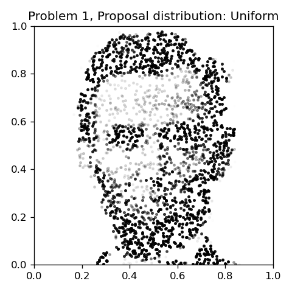
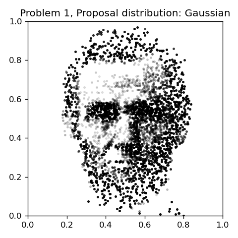
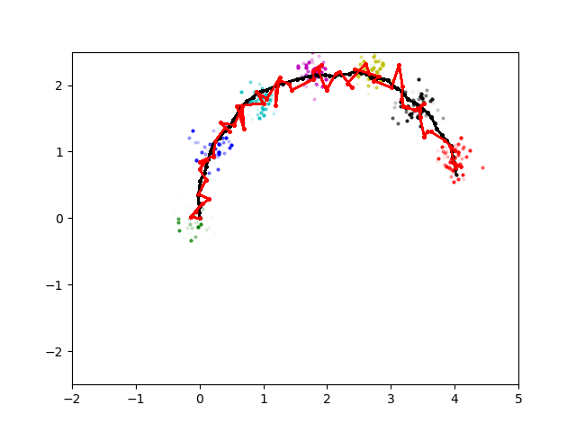
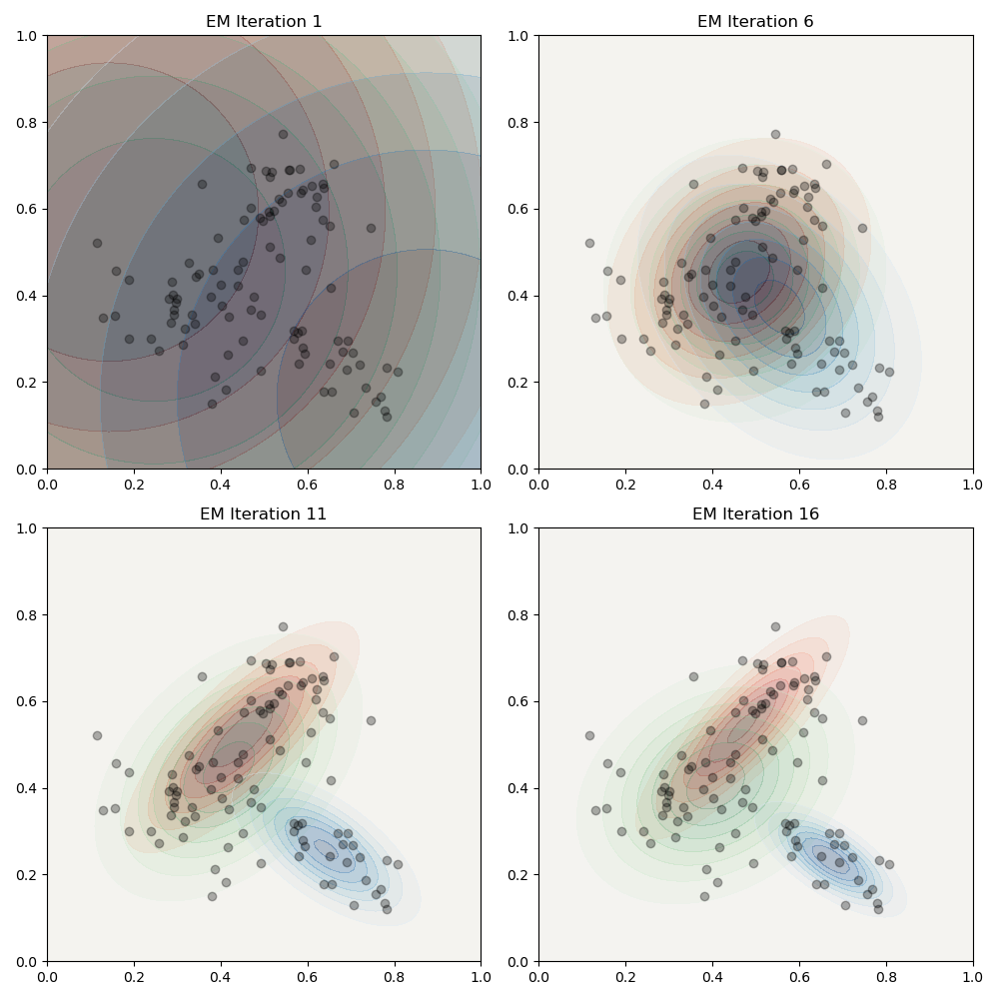
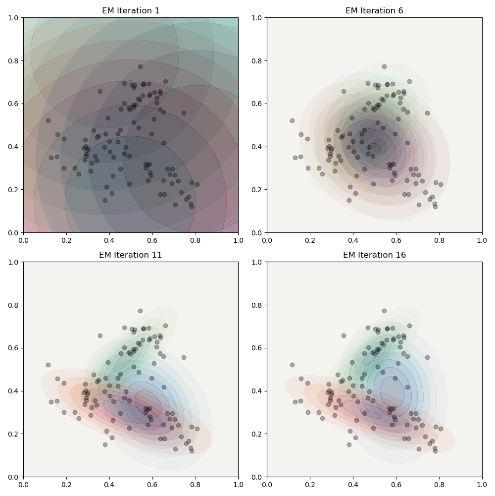
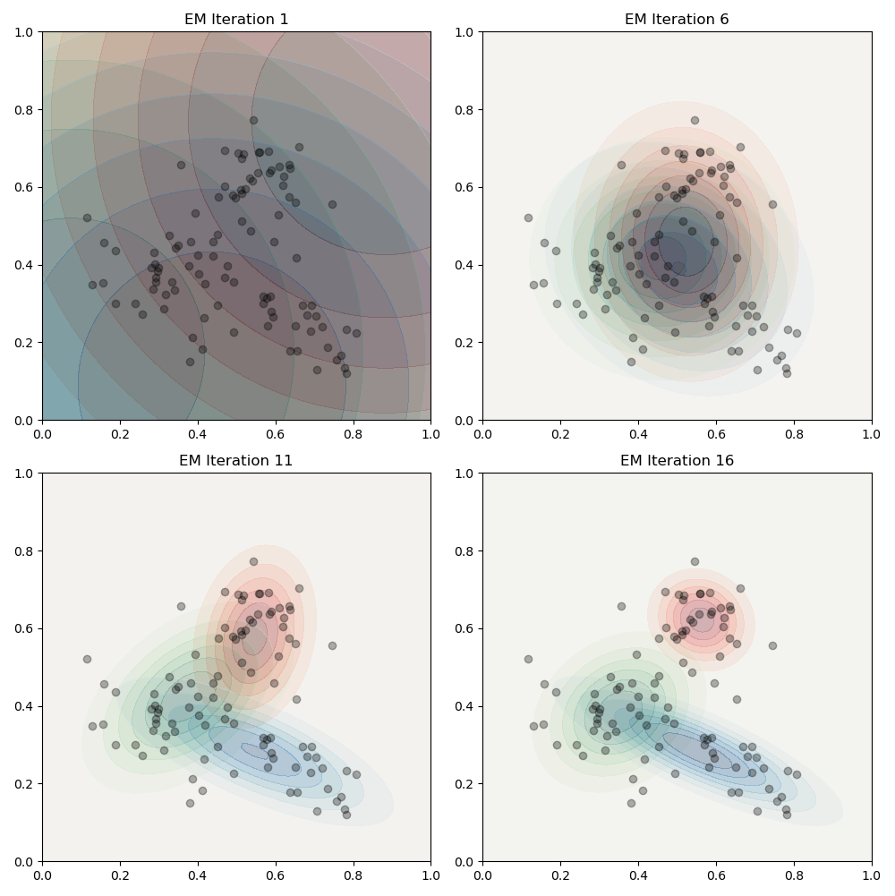

<h1 style="text-align: center;">ME455 Active Learning HW3</h1>

Graham Clifford

4/30/2024

### Problem 1
Uniform distribution as proposal distribution:  

Normal distribution as proposal distribution:  

### Problem 2

In the figure above, the black line is the ground truth trajectory
and the red line is the estimated trajectory. Each of the different color
splotches of dots represent the samples collected at time intervals of 0.1 seconds.

I've also included a gif of this plot being created.

### Problem 3
I think this works correctly, since sometimes the gaussian distributions look
horrible and sometimes they work great.

Here's an example of them looking nice:  

And here's an example where the gaussian distrubitions have significant overlap,
which I'm interpreting as the algorithm not doing a great job of discerning the
ground truth distributions.  

For fun, here's another trial where everything went well.  

There's also a gif of this simulation running attached as well.
