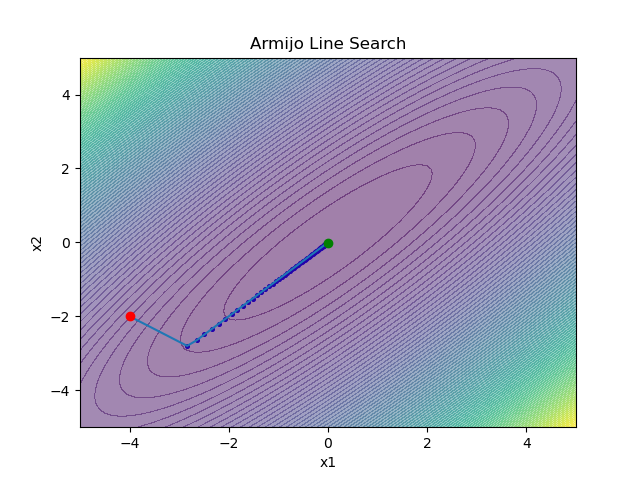
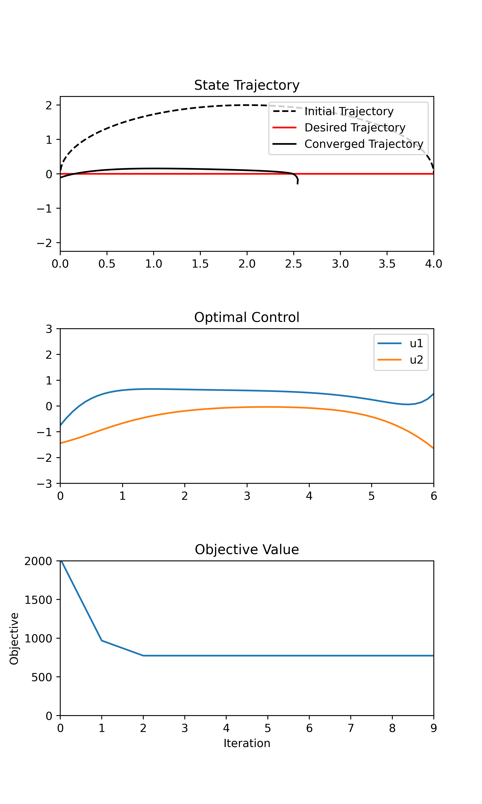
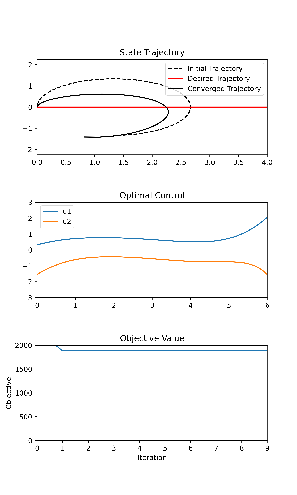
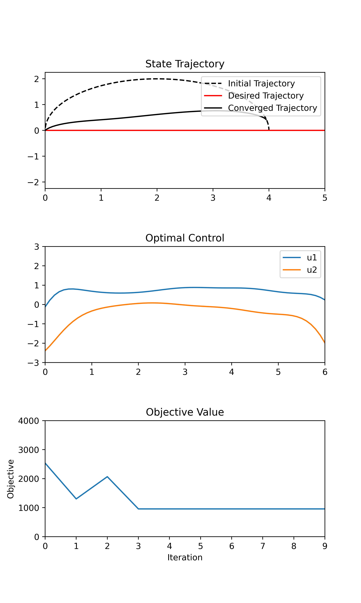

<h1 style="text-align: center;">ME455 Active Learning HW4</h1>

Graham Clifford

5/9/2024

### Problem 1
Please see handwritten pages for problem 1.

### Problem 2

### Problem 3

I'm not really sure why I couldn't get my plots to look like the example plots,
however I think there must be something wrong with either my iLQR algorithm
or the way I calculate my loss. I'm doing my iLQR algorithm where I calculate
the cumulative loss for the entire trajectory with the current control trajectory,
as well as the cumulative loss for the entire trajectory with the modified
control sequence (u + alpha * gamma). Maybe this is wrong, but it seemed to me
like the example code was encouraging this strategy. This leaves me with a loss
that plateaus at 1000, which is kinda weird.

The iteration above was with all default parameters. Here's an iteration where
the only thing I changed was the original control trajectory:
dt = 0.1
x0 = np.array([0.0, 0.0, np.pi/2.0])
tsteps = 63
**init_u_traj = np.tile(np.array([1.0, -0.75]), reps=(tsteps,1))**

Q_x = np.diag([10.0, 10.0, 2.0])
R_u = np.diag([4.0, 2.0])
P1 = np.diag([20.0, 20.0, 5.0])

Q_z = np.diag([5.0, 5.0, 1.0])
R_v = np.diag([2.0, 1.0])  
  
The converged trajectory seems to be focusing mainly on the initial trajectory,
and not the desired trajectory. 

I switched the initial control trajectory back to the default, and then tried to
get the final position of the differential drive robot to be close to the final
position of the initial trajectory.

Turns out all I really needed to do was change one of the values on the diagonal
in the Qx matrix:
Q_x = np.diag([95.0, 10.0, 2.0])  
  
This algorithm was tough to handle, I think it's possible it's slightly working,
however I can't be sure.

